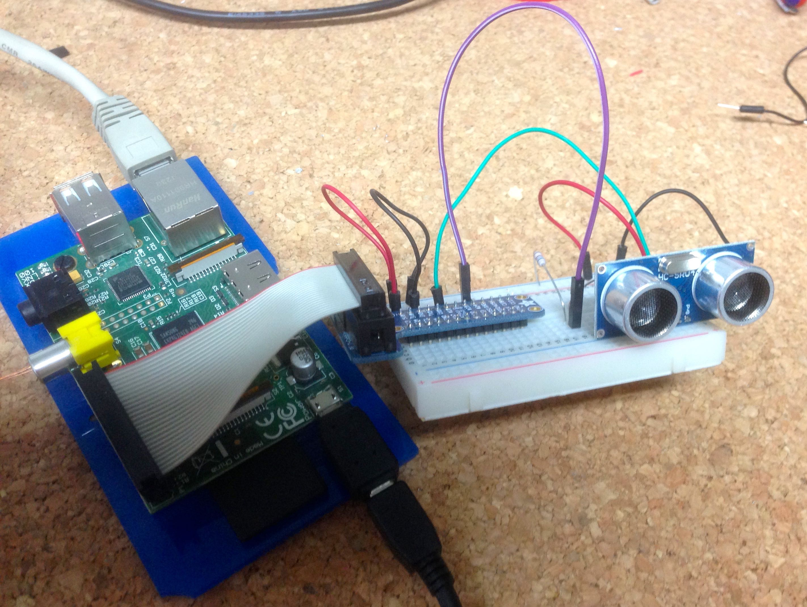
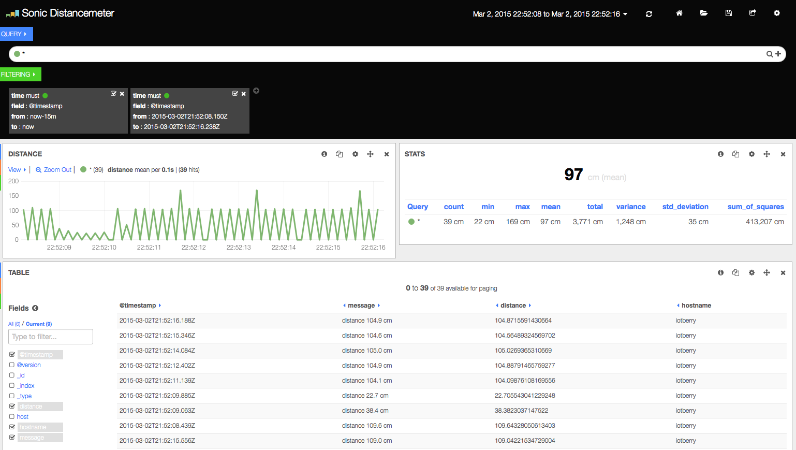

iot-distancemeter
======================

This is an example project that demonstrates a ultra-sonic sensor [HC-SR04](http://www.micropik.com/PDF/HCSR04.pdf) connected to a RaspberryPi.
The original connection scheme and code are from http://www.tutorials-raspberrypi.de/gpio/entfernung-messen-mit-ultraschallsensor-hc-sr04/ adopted to
sending the data to either Logstash/Elasticsearch/Kibana or via MQTT.



Either way, clone this repo on your RaspberryPi and your host where your server (Logstash or MQTT broker) is hosted.

```bash
$ git clone https://github.com/mp911de/iot-distancemeter.git
```

MQTT
-------
[MQTT](http://mqtt.org) is a machine to machine communication protocol in a pub/sub manner. To run the code you have to wire the ultrasonic
sensor to your RaspberryPi and you need python with the `paho-mqtt` package.

First you need a MQTT broker. I used [HiveMQ](http://hivemq.org) (execute it in the root path of this Git repo):

```bash
$ mkdir -p target
$ cd target
$ curl http://www.hivemq.com/wp-content/uploads/hivemq-2.2.1.zip > hivemq-2.2.1.zip
$ unzip hivemq-2.2.1.zip
$ cd hivemq-2.2.1/bin
$ chmod a+x *.sh
$ ./run.sh
```

Then continue on your RaspberryPi.

If you do not have the `paho-mqtt` package installed, execute (assuming you have `pip` installed):

```bash
$ sudo pip install paho-mqtt
```

Alternative using `easy_install`

```bash
$ sudo easy_install paho-mqtt
```

Adopt `MQTT_HOST` in `distancemeter_mqtt.py` to your environment and run it using

```bash
$ sudo python distancemeter_mqtt.py
```

Now the sensor performs measurement and publishes messages in the topic `sensors/distancemeter`.

To see something, you can start `mqtt_consumer.py` after adopting `MQTT_HOST` in the file.

```bash
$ python mqtt_consumer.py
```

You should see some output like:

```
Connected with result code 0
sensors/distancemeter {"distance": 104.49538230895996, "message": "distance 104.5 cm", "hostname": "iotberry"}
sensors/distancemeter {"distance": 103.15831899642944, "message": "distance 103.2 cm", "hostname": "iotberry"}
sensors/distancemeter {"distance": 103.20738554000854, "message": "distance 103.2 cm", "hostname": "iotberry"}
```

Logstash/Elasticsearch/Kibana
-----------------------------
You can run this demo also using the ELK-Stack. This way you can visualize the data in a nice way.

Install the ELK Stack using (execute it in the root path of this Git repo, you should use a better host than a RaspberryPi since all components are hungry for Memory and CPU):

```bash
$ mkdir -p target
$ cd target
$ curl https://download.elasticsearch.org/elasticsearch/elasticsearch/elasticsearch-1.3.2.zip > elasticsearch-1.3.2.zip
$ curl https://download.elasticsearch.org/logstash/logstash/logstash-1.4.2.zip > logstash-1.4.2.zip
$ unzip elasticsearch-1.3.2.zip
$ unzip logstash-1.4.2.zip
$ cd elasticsearch-1.3.2/bin
$ chmod a+x elasticsearch
$ ./elasticsearch &
$ cd ../..
$ cd logstash-1.4.2/bin
$ chmod a+x logstash
$ ./logstash agent -f ../../../logstash.conf &
$ ./logstash-web &
$ curl -XPUT 'http://localhost:9200/kibana-int/'
$ curl -XPUT --data-binary '@../../../dashboard-source.json' 'http://localhost:9200/kibana-int/dashboard/Sonic%20Distancemeter'
```

Now your server stack is running. Go to your RaspberryPi and adopt `JSON_HOST` in `distancemeter_json.py` so the Python
script knows where to send the JSON objects using TCP. Then run:

```bash
$ sudo python distancemeter_json.py
```

Your RaspberryPi will send every 0.2sec a message over the line. At this point open your browser. Kibana runs on port 9292,
so most likely you want to open:

http://localhost:9292/index.html#/dashboard/elasticsearch/Sonic%20Distancemeter

You should see something like:



Have fun!

License
-------
* [The MIT License (MIT)] (http://opensource.org/licenses/MIT)
* Contains also code from http://www.tutorials-raspberrypi.de/gpio/entfernung-messen-mit-ultraschallsensor-hc-sr04/

Contributing
-------
Github is for social coding: if you want to write code, I encourage contributions through pull requests from forks of this repository.
Create Github tickets for bugs and new features and comment on the ones that you are interested in.


